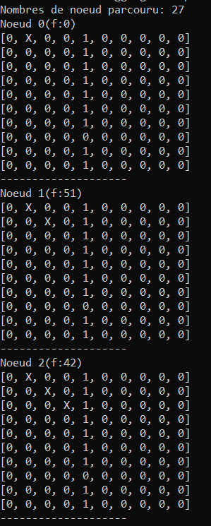
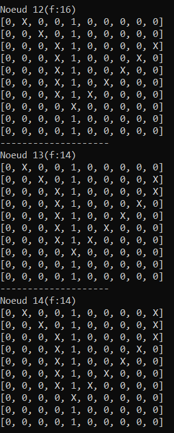
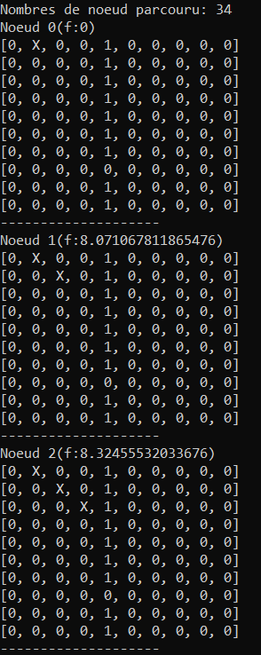
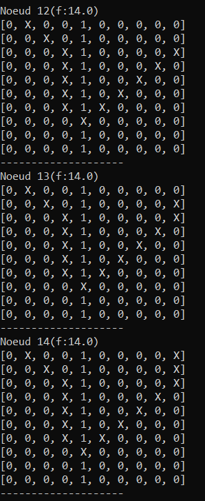
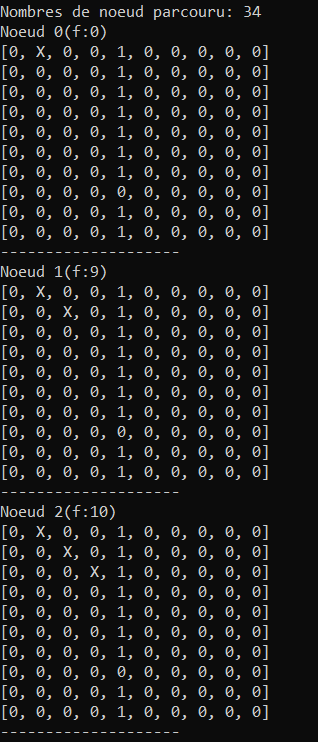
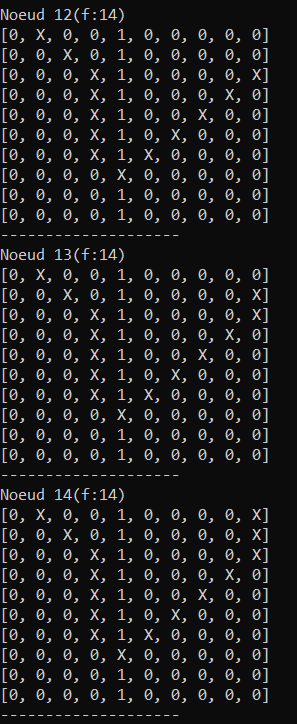

# A* Pathfinding on a Grid

Comparison of three heuristics for the A\* search algorithm on a 2D grid with
obstacles, written for a third-year undergraduate *Introduction to Artificial
Intelligence* course project.

The course brief asked for an open-ended project applying a technique seen in
class. The one chosen here is **state-space search**: apply A\* with different
heuristics to a path-planning problem, then measure how the choice of
heuristic affects the search.

## The problem

> Find a path between a point A and a point B on a grid that contains
> obstacles.

The world is a two-dimensional array of cells:

| Symbol | Meaning |
| --- | --- |
| `0` | free cell, the search may walk through it |
| `1` | obstacle, the search may not enter it |
| `X` | cell the search has already expanded |

Two variants of the problem are studied:

- **4-connected** — only up, down, left and right moves are allowed.
- **8-connected** — diagonal moves are allowed on top of the four above.

## The algorithm

A\* is a best-first search that orders the frontier by

```
f(n) = g(n) + h(n)
```

where `g(n)` is the cost accumulated from the start cell and `h(n)` is a
heuristic estimate of the cost left to reach the goal.

The implementation keeps the two lists of the classic formulation:

1. Put the start node in **OPEN**.
2. While **OPEN** is not empty:
   1. Take the node with the lowest `f` out of **OPEN** and put it in **CLOSED**.
   2. Mark its cell `X` on that node's copy of the grid.
   3. If it is the goal, walk the parent chain back up and return the path.
   4. Generate its neighbours from the move set, discarding those outside the
      grid, those on an obstacle and those already on the current path.
   5. For each neighbour, compute `g`, `h` and `f`. If a node for the same cell
      is already in **OPEN** or **CLOSED**, keep whichever of the two has the
      lower `g`, and drop the neighbour otherwise.
   6. Put the surviving neighbours in **OPEN**.

### Cost function

Every move costs the same, whether it is orthogonal or diagonal:

```
g(child) = g(parent) + 1
```

### Heuristics

The three heuristics compared, between a cell `(x1, y1)` and the goal `(x2, y2)`:

| Name | Formula | CLI value |
| --- | --- | --- |
| Squared distance | `(x1-x2)² + (y1-y2)²` | `squared` |
| Euclidean distance | `√((x1-x2)² + (y1-y2)²)` | `euclidean` |
| Manhattan distance | `\|x1-x2\| + \|y1-y2\|` | `manhattan` |

## Data

There is no external dataset. The two grid instances are 10×10 and are defined
directly in [`src/grids.py`](src/grids.py):

- **`wall`** — a vertical wall with a single opening on row 7, crossed from
  `(0, 1)` to `(0, 9)`. The start and the goal sit on the same row, so the
  search has to walk all the way around the wall. This is the instance the
  heuristics are benchmarked on.
- **`maze`** — the same wall plus a dead end in the lower-left corner, crossed
  from corner `(0, 0)` to corner `(9, 9)`.

## Repository layout

```
.
├── README.md
├── requirements.txt
├── docs
│   └── images        # screenshots of the runs reported below
└── src
    ├── astar.py      # Node class, the three heuristics, the A* search
    ├── grids.py      # the two grid instances, shared by the two entry points
    ├── main.py       # run one search and print the path step by step
    └── benchmark.py  # run every heuristic/move-set pair and print the table
```

## Requirements

Python 3.8 or later. The project uses the standard library only, so there is
nothing to install — see [`requirements.txt`](requirements.txt).

## Running it

Both entry points are run from the `src` directory.

```bash
cd src
```

### Reproduce the result tables

```bash
python benchmark.py --grid wall     # the benchmark instance
python benchmark.py --grid maze     # the harder instance
```

### Watch a single search

```bash
python main.py                                            # maze, squared, 8-connected
python main.py --grid wall --heuristic manhattan --moves 4
python main.py --grid maze --heuristic euclidean --quiet  # counts only
```

| Option | Values | Default |
| --- | --- | --- |
| `--grid` | `wall`, `maze` | `maze` |
| `--heuristic` | `squared`, `euclidean`, `manhattan` | `squared` |
| `--moves` | `4`, `8` | `8` |
| `--quiet` | flag, prints counts without the grids | off |

Without `--quiet`, `main.py` prints the grid at every step of the path, which
is how the figures in the project report were produced:

```
Node 17 (f: 17)
[X, 0, 0, 0, 1, 0, 0, 0, 0, 0]
[0, X, 0, 0, 1, 0, 0, 0, 0, 0]
...
--------------------
```

## Results

Each cell gives **nodes expanded** (how many nodes A\* took off the OPEN list
before reaching the goal) and the **path length** it returned, in number of
cells including the start.

### Benchmark instance (`wall`), `(0, 1)` → `(0, 9)`

| Moves | Squared | Euclidean | Manhattan |
| --- | --- | --- | --- |
| 4-connected | **38** nodes / length 23 | 82 nodes / length 23 | 72 nodes / length 23 |
| 8-connected | **27** nodes / length 15 | 34 nodes / length 15 | 34 nodes / length 15 |

#### Step by step, 8-connected

The screenshots below come from the original runs on the benchmark instance
with diagonals allowed, which is why their labels are in French: `Nombres de
noeud parcouru` is the number of nodes expanded and `Noeud n(f:…)` is step `n`
of the returned path. Each run is shown twice, at its first three steps and at
its last three.

The left column is the **departure**: the first line gives the total number of
nodes expanded, then `Noeud 0` shows the start cell marked `X` and the search
beginning to move. The right column is the **arrival**: `Noeud 14` is the last
step, where the trail of `X` runs from the start, around the wall through the
opening on row 7, and up to the goal in the top-right corner.

**Squared distance — 27 nodes expanded, path of 15 cells**

| First steps | Last steps |
| --- | --- |
|  |  |

**Euclidean distance — 34 nodes expanded, path of 15 cells**

| First steps | Last steps |
| --- | --- |
|  |  |

**Manhattan distance — 34 nodes expanded, path of 15 cells**

| First steps | Last steps |
| --- | --- |
|  |  |

The three runs reach the same goal by paths of the same length, but the `f`
values differ sharply: the squared distance opens at `f:51` on the first step
against `f:8.07` for the Euclidean distance and `f:9` for the Manhattan one,
and the whole ranking of the frontier follows from that gap.

### Harder instance (`maze`), `(0, 0)` → `(9, 9)`

| Moves | Squared | Euclidean | Manhattan |
| --- | --- | --- | --- |
| 4-connected | **37** nodes / length 25 | 50 nodes / length 23 | 49 nodes / length 23 |
| 8-connected | **25** nodes / length 18 | 37 nodes / length 18 | 38 nodes / length 18 |

### Analysis

**The squared distance explores the fewest nodes, by a wide margin.** On the
benchmark instance it expands 38 nodes against 82 and 72 for the other two in
the 4-connected variant — roughly half the search effort. The gap narrows in
the 8-connected variant (27 against 34) but the ranking does not change.

**The Euclidean and Manhattan distances behave almost identically.** They are
within a few nodes of each other on every configuration tested, and give
exactly the same count (34) in the 8-connected variant of the benchmark
instance. Both grow roughly linearly with the distance to the goal, so they
order the frontier in a very similar way.

**Allowing diagonals cuts the search down sharply.** Going from 4 to 8
connectivity drops the expanded nodes from 38 to 27, 82 to 34 and 72 to 34,
and shortens the path from 23 cells to 15. Diagonal moves let the search head
straight at the goal instead of walking the two legs of a right angle.

**The speed of the squared distance comes at a price.** It is not an
*admissible* heuristic: because it squares the distance, it overestimates the
real remaining cost, so A\* loses its guarantee of returning a shortest path
and drifts towards a greedy best-first search. Being larger, `h` dominates `g`
and the search commits to whatever looks closest to the goal instead of
balancing the cost already paid.

That trade-off is visible in the tables: on the `maze` instance in the
4-connected variant, the squared distance returns a path of **25 cells where
the other two return 23**. It expanded the fewest nodes and still got the
wrong answer. On the benchmark instance the path happens to come out the same
length for all three heuristics, which is why the effect goes unnoticed there.

The conclusion is therefore a conditional one: the squared distance is the
best choice when the goal is to reach *a* path quickly, while the Euclidean
and Manhattan distances are the ones to use when the path has to be the
shortest.
